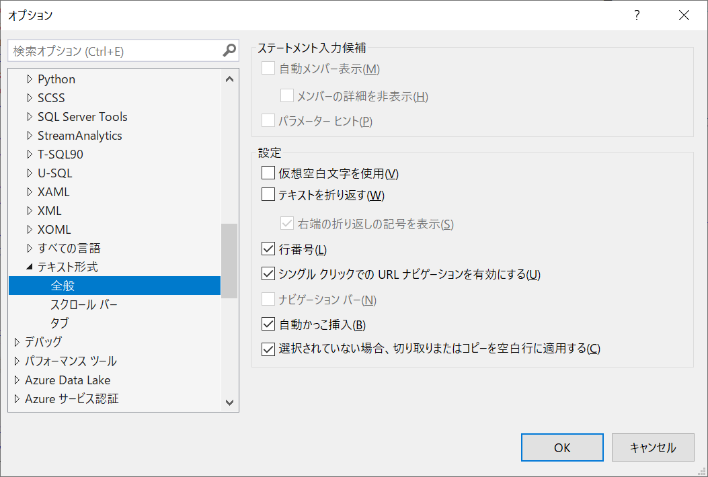
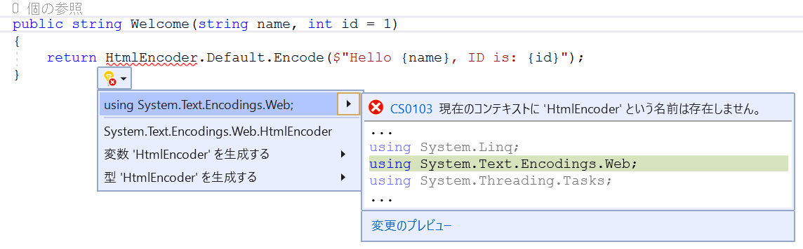
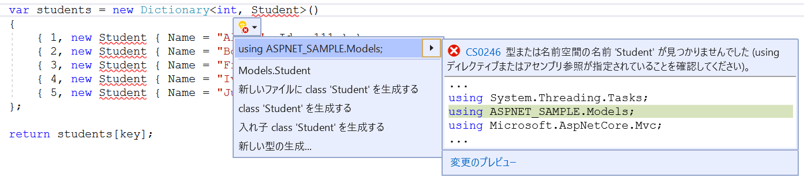

# ASP.NET Core MVC アプリの作成

<br />

- コントローラーの追加

<br />

## [Visual Studio] コードエディタに行番号を表示
-  [ツール] - [オプション] を選択  
[テキストエディター] - [テキスト形式] - [全般] から設定

    

<br />

## コントローラーの追加
### Slide 16-5

- HelloWorldController.cs  
15 行目で改行を行い Welcome メソッドを追加

    ```cs
    using System;
    using System.Collections.Generic;
    using System.Linq;
    using System.Threading.Tasks;
    using Microsoft.AspNetCore.Mvc;

    namespace ASPNET_SAMPLE.Controllers
    {
        public class HelloWorldController : Controller
        {
            public IActionResult Index()
            {
                return View();
            }

            public string Welcome()
            {
                return "This is the Welcome action method...";
            }
        }
    }
    ```

<br />

## パラメーター情報を渡せるよう Welcome メソッドを変更
### Slide 17-8

- HelloWorldController.cs  
17 行目の Welcome() を Welcome(string name, int id = 1) へ変更  
19 行目の return 句で返す文字列を変更

    ```cs
    using System;
    using System.Collections.Generic;
    using System.Linq;
    using System.Text.Encodings.Web;
    using System.Threading.Tasks;
    using Microsoft.AspNetCore.Mvc;

    namespace ASPNET_SAMPLE.Controllers
    {
        public class HelloWorldController : Controller
        {
            public IActionResult Index()
            {
                return View();
            }

            public string Welcome(string name, int id = 1)
            {
                return HtmlEncoder.Default.Encode($"Hello {name}, ID is: {id}");
            }
        }
    }
    ```
    ＊using System.Text.Encodings.Web ステートメントが自動で追加

    ＊追加されない場合、表示されるヒントから追加が可能

    

<br />

## ビューの追加
### Slide 19-2

- Index.cshtml  
9 行目に \<p\>...\</p\> タグを追加

    ```html
    @{
        ViewData["Title"] = "Index";
        Layout = "~/Views/Shared/_Layout.cshtml";
    }

    <h1>Index</h1>

    <p>Hello from our View Template!</p>
    ```

<br />

## コントローラーからビューへのデータの受け渡し
### Slide 20-1, 2

- HelloWorldController.cs  
14 行目に ViewData["message"] ... を追加

    ```cs
    using System;
    using System.Collections.Generic;
    using System.Linq;
    using System.Text.Encodings.Web;
    using System.Threading.Tasks;
    using Microsoft.AspNetCore.Mvc;

    namespace ASPNET_SAMPLE.Controllers
    {
        public class HelloWorldController : Controller
        {
            public IActionResult Index()
            {
                ViewData["message"] = "Hello from HelloWorld Controller";

                return View();
            }

            public string Welcome(string name, int id = 1)
            {
                return HtmlEncoder.Default.Encode($"Hello {name}, ID is: {id}");
            }
        }
    }
    ```
    ＊**ViewData** : 一時的にデータを保管し Controller - View 間で受け渡す際に使用

<br />

- Index.cshcml  
9 行目の \<p\>...\</p\> 要素を変更

    ```html
    @{
        ViewData["Title"] = "Index";
        Layout = "~/Views/Shared/_Layout.cshtml";
    }

    <h1>Index</h1>

    <p>@ViewData["message"]</p>
    ```

<br />

## データ モデル クラスの追加
### Slide 23-3

- Student.cs  
9-10 行目の間に Name, Id プロパティを挿入

    ```cs
    using System;
    using System.Collections.Generic;
    using System.Linq;
    using System.Threading.Tasks;

    namespace ASPNET_SAMPLE.Models
    {
        public class Student
        {
            public string Name { get; set; }

            public int Id { get; set; }
        }
    }
    ```

<br />

## コントローラーからモデルを操作
### Slide 24-2

- HelloWorldController.cs  
7 行目に using ASPNET_SAMPLE.Models; を追加  
＊プロジェクトを ASPNET_SAMPLE で作成していない場合は、自身のプロジェクト名へ変更  
Welcome(string name, int id = 1) を Welcome(int key) へ変更  
メソッドの内容も変更


    ```cs
    using System;
    using System.Collections.Generic;
    using System.Linq;
    using System.Text.Encodings.Web;
    using System.Threading.Tasks;
    using Microsoft.AspNetCore.Mvc;
    using ASPNET_SAMPLE.Models;

    namespace ASPNET_SAMPLE.Controllers
    {
        public class HelloWorldController : Controller
        {
            public IActionResult Index()
            {
                ViewData["message"] = "Hello from HelloWorld Controller";

                return View();
            }

            public string Welcome(int key)
            {
                var students = new Dictionary<int, Student>()
                {
                    { 1, new Student { Name = "Alice", Id = 111 } },
                    { 2, new Student { Name = "Bob", Id = 112 } },
                    { 3, new Student { Name = "Frank", Id = 113 } },
                    { 4, new Student { Name = "Ivan", Id = 114 } },
                    { 5, new Student { Name = "Judy", Id = 115 } }
                };

                return $"Hello {students[key].Name}, ID is: {students[key].Id}";
            }
        }
    }
    ```
    ＊using ステートメントを追加していない場合は、ヒントから追加も可

    

<br />

## コントローラー アクションとビュー
### Slide 26-1, 27-2

- HelloWorldController.cs  
Welcome メソッドの戻り値を string から Student に変更、それに伴い return 句も変更  
Result メソッドを追加

    ```cs
    using System;
    using System.Collections.Generic;
    using System.Linq;
    using System.Text.Encodings.Web;
    using System.Threading.Tasks;
    using Microsoft.AspNetCore.Mvc;
    using ASPNET_SAMPLE.Models;

    namespace ASPNET_SAMPLE.Controllers
    {
        public class HelloWorldController : Controller
        {
            public IActionResult Index()
            {
                ViewData["message"] = "Hello from HelloWorld Controller";

                return View();
            }

            public Student Welcome(int key)
            {
                var students = new Dictionary<int, Student>()
                {
                    { 1, new Student { Name = "Alice", Id = 111 } },
                    { 2, new Student { Name = "Bob", Id = 112 } },
                    { 3, new Student { Name = "Frank", Id = 113 } },
                    { 4, new Student { Name = "Ivan", Id = 114 } },
                    { 5, new Student { Name = "Judy", Id = 115 } }
                };

                return students[key];
            }

            [HttpPost]
            public IActionResult Result(int key)
            {
                Student model;

                try
                {
                    model = Welcome(key);
                }
                catch
                {
                    return View("Error", new ErrorViewModel { RequestId = "1" });
                }

                return View(model);
            }
        }
    }
    ```

<br />

### Slide 30-7
- Result.cshtml  
1 行目に @model ... を追加  
\<h1\> タグに diplay-4 クラスを追加  
9 行目に \<p\> ... \<p\> を追加


    ```html
    @model ASPNET_SAMPLE.Models.Student
    @{
        ViewData["Title"] = "Result";
        Layout = "~/Views/Shared/_Layout.cshtml";
    }

    <h1 class="display-4">Result</h1>

    <p>Hello @Model.Name, ID is: @Model.Id</p>
    ```
    ＊プロジェクトを ASPNET_SAMPLE で作成していない場合は、自身で作成したプロジェクト名に変更

<br />

### Slide 31-8
- Index.cshtml  
11 行目から @using ... 句を追加

    ```html
    @{
        ViewData["Title"] = "Index";
        Layout = "~/Views/Shared/_Layout.cshtml";
    }

    <h1>Index</h1>

    <p>@ViewData["message"]</p>

    @using(Html.BeginForm("Result", "HelloWorld", FormMethod.Post))
    {
        <input type="text" name="key" /> <input type="submit" value="Submit" />
    }
    ```

<br />

### Slide 32-1
- _Layout.cshtml

  ＊\<header\> 要素内に 26 行後に \<li\> ... \<li\> 要素でメニューを追加

    ```html
    <!DOCTYPE html>
    <html lang="en">
    <head>
        <meta charset="utf-8" />
        <meta name="viewport" content="width=device-width, initial-scale=1.0" />
        <title>@ViewData["Title"] - ASPNET_SAMPLE</title>
        <link rel="stylesheet" href="~/lib/bootstrap/dist/css/bootstrap.min.css" />
        <link rel="stylesheet" href="~/css/site.css" />
    </head>
    <body>
        <header>
            <nav class="navbar navbar-expand-sm navbar-toggleable-sm navbar-light bg-white border-bottom box-shadow mb-3">
                <div class="container">
                    <a class="navbar-brand" asp-area="" asp-controller="Home" asp-action="Index">ASPNET_SAMPLE</a>
                    <button class="navbar-toggler" type="button" data-toggle="collapse" data-target=".navbar-collapse" aria-controls="navbarSupportedContent"
                        aria-expanded="false" aria-label="Toggle navigation">
                        <span class="navbar-toggler-icon"></span>
                    </button>
                    <div class="navbar-collapse collapse d-sm-inline-flex flex-sm-row-reverse">
                        <ul class="navbar-nav flex-grow-1">
                            <li class="nav-item">
                            <a class="nav-link text-dark" asp-area="" asp-controller="Home" asp-action="Index">Home</a>
                            </li>
                            <li class="nav-item">
                            <a class="nav-link text-dark" asp-area="" asp-controller="Home" asp-action="Privacy">Privacy</a>
                            </li>
                            <li class="nav-item">
                                <a class="nav-link text-dark" asp-area="" asp-controller="HelloWorld" asp-action="Index">HelloWorld</a>
                            </li>
                        </ul>
                    </div>
                </div>
            </nav>
        </header>
        <div class="container">
            <main role="main" class="pb-3">
            @RenderBody()
            </main>
        </div>

        <footer class="border-top footer text-muted">
            <div class="container">
            &copy; 2020 - ASPNET_SAMPLE - <a asp-area="" asp-controller="Home" asp-action="Privacy">Privacy</a>
            </div>
        </footer>
        <script src="~/lib/jquery/dist/jquery.min.js"></script>
        <script src="~/lib/bootstrap/dist/js/bootstrap.bundle.min.js"></script>
        <script src="~/js/site.js" asp-append-version="true"></script>
        @RenderSection("Scripts", required: false)
    </body>
    </html>
    ```
    ＊24-26 行をコピーして貼り付けると容易  
    　asp-controller の Home を HelloWorld, asp-action の Privacy を Index へ変更  
    　\<a\>...\<a\> の Privacy を任意の文字列に変更
